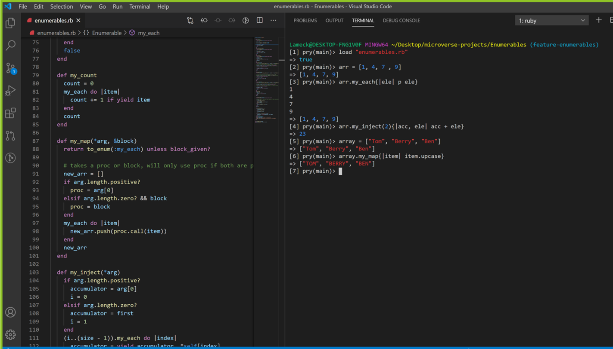

# Enumerable methods

Enumerable is a collection of iteration methods, a Ruby module, and a great part of what makes ruby a great programming language. In this project, we try to customize some of the Ruby enumerable functions.



# Getting Started

- Clone this repository: ```git clone https://github.com/Igors78/Enumerables```
- Change directory to Enumerables folder
- Open pry and run the following command

```
load "enumerables.rb"
```

- Call methods in side ```enumerables.rb``` file, executing any of the methods on an Array Object

    - For example

    ```
    [1, 4, 7].my_map do |element|
        element * 2
    end

    => [2, 8, 14]


    [1, 4, 7].my_all(String)
    => false
    ```

## Live Demo

[Live Demo Link](https://repl.it/@Igors78/enumerablesrb#main.rb)

## Built with

- Ruby

## Authors

👤 **Lameck Otieno**
- GitHub: [@githubhandle](https://github.com/Lameck1)
- Twitter: [@twitterhandle](https://twitter.com/lameck721)
- LinkedIn: [LinkedIn](https://www.linkedin.com/in/lameck-odhiambo-642b7077/)

👤 **Igors Oleinikovs**
- GitHub: [@githubhandle](https://github.com/Igors78)
- Twitter: [@twitterhandle](https://twitter.com/oleinikovs)
- LinkedIn: [LinkedIn](https://www.linkedin.com/in/igors-oleinikovs-17a10958/)


## 🤝 Contributing

Contributions, issues, and feature requests are welcome!

## Show your support

Give a ⭐️ if you like this project!

## Acknowledgments

- Ruby docmentation
- [Ruby Guides](https://www.rubyguides.com/)

## 📝 License

This project is [MIT](./LICENSE) licensed.


